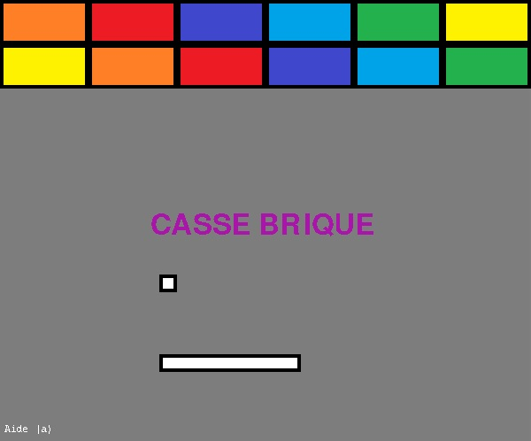
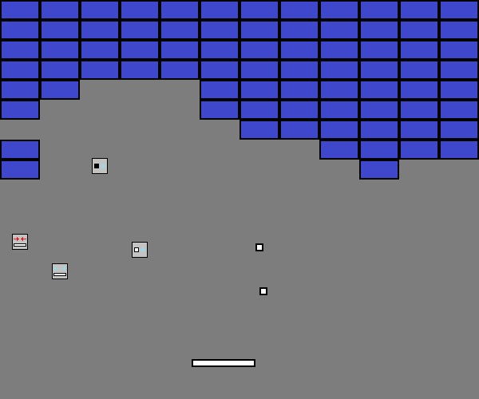

# Python-Brick-Breaker-Game

This is a brick-breaker game made in Python.
## Features
- The game
- Various levels
- Some bonus and malus
## Installation
1. Download the repository by clicking on `Code > Download ZIP`
2. Extract the ZIP file
3. Run `main.pyw`
## Requirements
- Python 3.7
- Python `pygame` library
- Python `random` library
## Usage
After running `main.pyw` you will see the game window. To start a game you have to press `ENTER`. And then in game you can move the bar with `LEFT` and `RIGHT` arrow keys or pause the game with `ENTER`.

